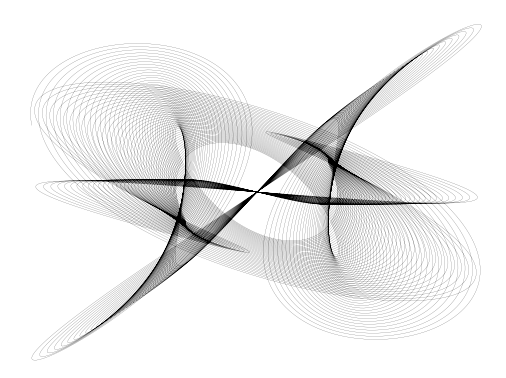
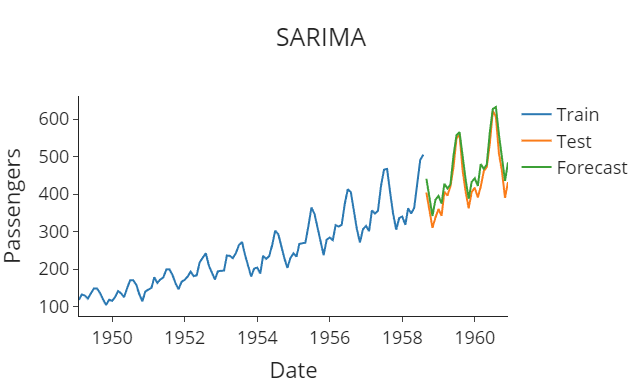

# maths

a little playground to examine basic calculations.
In this repo, we are going to examine code that we can then apply to real world scenarios.

List of topics:

- [Time Series](#time-series)
- Statistics
- Algorithms
- Arithmetic
- Charts
- Numpy

# Time Series

# Statistics

        
